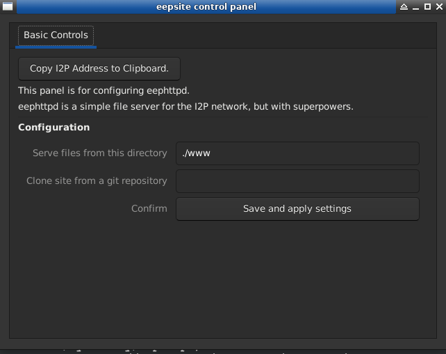

eepHttpd - easy-to-use tool for setting up I2P Sites
====================================================

eepHttpd is the easiest tool for hosting new sites on the I2P network from your own
computer(As long as they are mostly *static* sites, for now). You start the application
and it sets up a directory in a logical place on your system. It has some neat features 
to make your sites available to people who want it even when you aren't available to
host it. Probably the most cool thing that it can do is that it can mirror most github
pages as long as they are statically pre-generated. The I2P Site itself is actually just
a clone of the github repository, making the act of mirroring the site also the act of
mirroring the source code.

Homepages:
----------

- **[I2P Site](http://tvndxxkxcstbtqfxg7iigco6bj22ff2y6jxikmk7wqkyadkhrd4a.b32.i2p/)**
- **[I2P Torrent](http://tvndxxkxcstbtqfxg7iigco6bj22ff2y6jxikmk7wqkyadkhrd4a.b32.i2p/eephttpd.torrent)**
- **[Visible Internet Site](https://eyedeekay.github.io/eephttpd)**

Releases:
---------

- **[Releases](https://github.com/eyedeekay/eephttpd/releases)**

Screenshot:
-----------

Example Setup:
--------------

On Windows the default site will be created in the `My Documents` folder, and it will be
empty by default. For example:

        C:\\Documents and Settings\User\My Documents\I2P_Site

On Unixes(Linux and OSX are tested but any Unix should work) it will be the `I2P_Site` directory
in the directory where you run the application. So if you ran the application from

        /home/user/eephttpd/I2P_Site

then you would end up with a `I2P_Site` directory there, for example:

        /home/user/eephttpd/I2P_Site/

Just put the files you want to serve, like your web site or open directory of content, inside
of that directory.

Example Clone:
--------------

eepHttpd is capable of mirroring a static site stored in a git repository. Sort of like
a self-hosted github page. This feature is accessible via the GUI. To do this, fill in the
`Clone Site from a git repository` section.

This example will mirror the eephttpd site itself. It should work for most github pages and
all static sites.

Learn More:
-----------

- **[Source Code](https://github.com/eyedeekay/eephttpd)**
- **[File an issue, request a feature](https://github.com/eyedeekay/eephttpd/issues)**
- **[Make a pull request](https://github.com/eyedeekay/eephttpd/pulls)**
